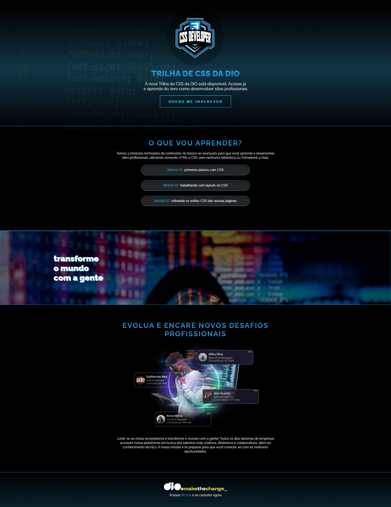

# projeto-landingpage

Projeto de criação de landing page realizado pelo Bootcamp Santander 2025 - Front-end.

Desenvolvi a landing page observando os elementos do projeto original e através das diretrizes do Figma.

O projeto já conta com certa responsividade, sendo necessário a implementação de media query para dispositivos móveis para alcançar completa responsividade.

## Translate

Santander 2025 - Front-end Bootcamp: Landing Page Project.

I developed the landing page, closely referencing the original project's elements and adhering to the guidelines provided in Figma.

The project currently offers some responsiveness, but full mobile responsiveness will require the implementation of media queries.

## Access Here

<a href="https://www.figma.com/design/3PiokoJj9IhGDnNiWAJbz7/DIO---Desafio-01?node-id=0-1&p=f&t=wvtONGbHofkeGS5H-0" target=_blank> Visit the original project</a>

<a href=">

## Screenshots

  

